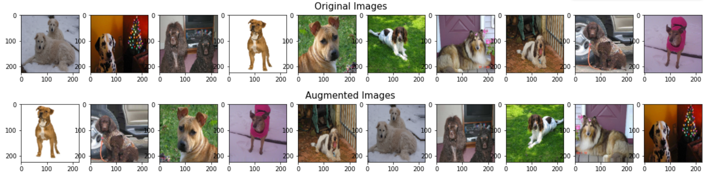
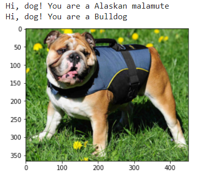
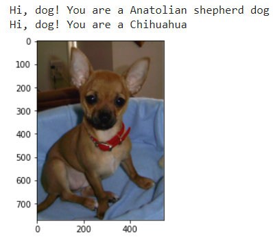
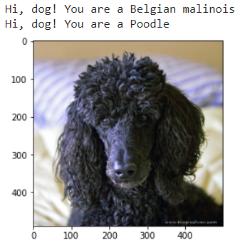
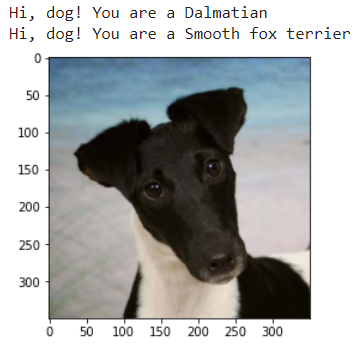
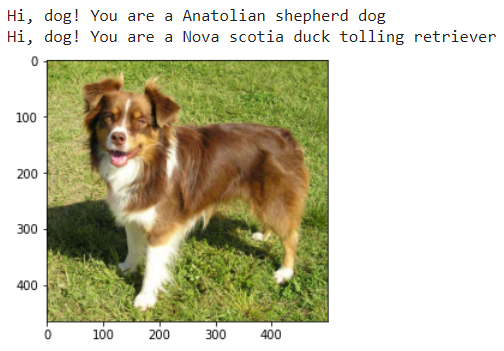
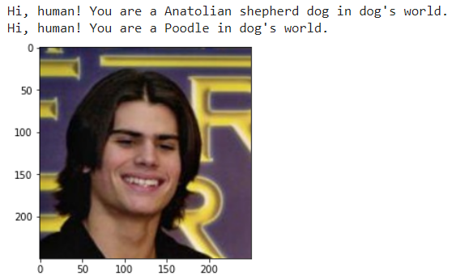

# Dog Breed Classifier

## Table of contents
1. [Introduction](#Introduction)
2. [How to run](#Howtorun)
    1. [Requirements](#Requirements)
    2. [Instructions](#Instructions)
3. [Results](#Results)
    1. [Dog and human detector accuracy](#Dogandhumandetectoraccuracy)
    2. [Data augmentation](#DataAugmentation)
    3. [Model accuracy](#ModelAccuracy)
4. [Acknowledgement](#Acknowledgement)

## Introduction

### Objective:
 To train a model using CNN that categorizes dogs, humans, or any species into their similar dog breeds. 

### Overview:
  There is a detector that detects whether the input picture contains a dog or human. The human detector employs one of OpenCV's pre-trained face detector, [Haar feature-based cascade classifiers](http://docs.opencv.org/trunk/d7/d8b/tutorial_py_face_detection.html), while the dog detector employs a pre-trained ResNet-50 model (weights trained on ImageNet).\
  \
  As for the dog breed classifier, two models are trained from a labled dog breed dataset, one model built from scratch and the other built from the pre-trained VGG-16 model.

## How to run

### 1. Requirements

Python 3\
Libraries: SKlearn, keras, numpy, glob, cv2, random, tqdm, PIL, matplotlib.

### 2. Instructions

  1.	Download the dataset of classified [dog images](https://s3-us-west-1.amazonaws.com/udacity-aind/dog-project/dogImages.zip) and the dataset of [humans](https://s3-us-west-1.amazonaws.com/udacity-aind/dog-project/lfw.zip).
  2.  Download the pretrained model, [Haar feature-based cascade classifiers](https://github.com/opencv/opencv/tree/master/data/haarcascades), and the [VGG-16 bottleneck features](https://s3-us-west-1.amazonaws.com/udacity-aind/dog-project/DogVGG16Data.npz).
  3.  The code can run using google colab. (File paths need to be modified.)

## Results

### 1. Dog and human detector accuracy
    1. 100 human photos:
        Humans: 0.97
        Dogs: 0.0
        Both are detected: 0.02
        Unknown species 0.01
        
    2. 100 dog photos:
        Humans: 0.0
        Dogs: 0.88
        Both are detected: 0.12
        Unknown species 0.0
 

### 2. Data augmentation

### 3. Model accuracy

    1. Model 1: from scratch
       Test accuracy:  10.4066985645933 % (epoch: 20, batch size: 20)
    2. Model 2: VGG-16 Model:
       Test accuracy:  74.76076555023923 % (epoch: 20, batch size: 20)
       

 \
Model 1: wrong, Model 2: correct

 \
Model 1: wrong, Model 2: correct

 \
Model 1: wrong, Model 2: correct

 \
Model 1: wrong, Model 2: correct

 \
Model 1: wrong, Model 2: wrong, should be an Australian Shepherd\

\
Human detected! Breed classified!

### Acknowledgement
Thanks to Udacity for the dataset, template, and training.
